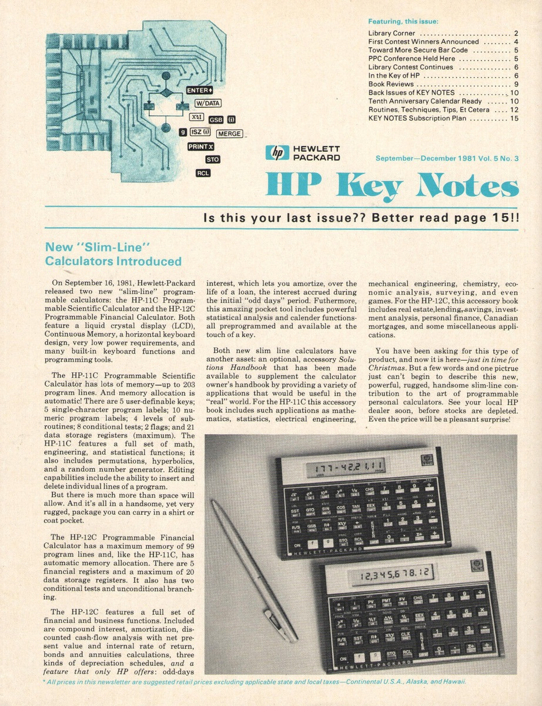

```{=html}
<a class="lab-open-btn" href="../../slides/lab-opening-w01.html?fs=1"
   target="_blank" rel="noopener">
  <span class="lab-open-ico">&#9654;</span>
  Lab opening &middot; Week 01
  <span class="lab-open-sub">full screen</span>
</a>
```

::: {.callout-note}
Your own private GitHub repository is waiting for you, but get the order
right: **start your Coder workspace first**, connect VS Code to it, and only
then clone the repository onto the Calvin machine (see
[Getting the code](#getting-the-code) below). Cloning onto your own laptop
instead gives you code you cannot compile.

**Plan to set aside about 3 to 3.5 hours.** Writing the header and finding the
first fault are the slow parts; once the machine runs at all, the rest moves
quickly. The three new instructions are the take-home half.
:::

## Objectives

By the end of this assignment, you will be able to:

- Write a header file from scratch, with an include guard and a set of prototypes
- Explain why a function that must change its caller's variable takes a reference
- Find a fault in working code by comparing what it does against what it should do
- Use `switch` with `break` to dispatch on a value, and say what happens without the `break`
- Write a loop whose counter moves backwards through an array
- Recognise unsigned underflow as a cause rather than as a curiosity
- Pass an array to a function, and explain why its length has to travel separately
- Describe how a stored program, a stack and a program counter make a computer

### The skills this trains

These objectives map to course skills **A2**, **A3**, and **A4**, all in
cluster **A, C++ Foundations**, which you demonstrate at check-in window
**W1**. This is the assignment where A4 is genuinely tested rather than
introduced.

| Skill | | Where it shows up here |
|---|---|---|
| **A2** | basic data types, variables, `const`, operators | `unsigned` for the stack depth, `const` on the parameters that only read, and the underflow that happens when an `unsigned` goes below zero |
| **A3** | pointers | not `new` and `delete`, which arrive in week 4, but the reason `run` has to be told how long the program is: an array becomes a pointer the moment it is passed to a function |
| **A4** | control structures and functions with correct parameter passing | the whole assignment. The `switch` that dispatches on an instruction, the loop that fetches them, and six functions whose parameter modes decide whether the machine works |

::: {.callout-note}
**A4 is the one to watch.** It is marked *persistent* in the course plan, which
means it keeps being assessed after this week rather than being ticked off and
forgotten. Everything from a03 onward assumes you can decide, without being
told, whether a parameter should be passed by value, by reference, or by
`const` reference. Fault 4 in this assignment is what that decision looks like
when it goes wrong.
:::

---

## 1. The CS112 Model 112

Before phones, before laptops, engineers carried a calculator that could be
*programmed*. You entered a sequence of keystrokes once, the calculator
remembered them, and from then on you could replay the whole calculation with a
single button. The HP-12C, launched in 1981, is still sold today.

{#fig-hp12c fig-alt="The front page of the Hewlett-Packard newsletter HP Key Notes, volume 5 number 3, September to December 1981. The lead article, New Slim-Line Calculators Introduced, announces that on September 16, 1981 Hewlett-Packard released the HP-11C Programmable Scientific Calculator and the HP-12C Programmable Financial Calculator. A photograph at the bottom shows the two flat calculators lying beside a pen, one display reading 177-42.21.11 and the other 12,345,678.12." width="70%"}

What makes that possible is a small idea with large consequences. The
calculator does not store a formula. It stores **the keystrokes themselves**, as
a list of numbers, and then presses them for you.

You are repairing the firmware of one of these: the **CS112 Model 112**. The
hardware is already manufactured, so the only thing anybody can change now is
the code, and the only place to test a change is the bench simulator, which is
what `make test` is.

### How it thinks

The Model 112 has no variables. It has one pile of numbers, called the
**stack**. Every instruction either puts a number on top of the pile, or takes
one or two off the top and puts a result back.

Here is a program that computes `(7 + 5) * 3`:

```
PUSH 7
PUSH 5
ADD
PUSH 3
MUL
PRINT
HALT
```

And here is the pile after each line:

| Instruction | The stack afterwards | What happened |
|---|---|---|
| `PUSH 7` | `7` | put 7 on top |
| `PUSH 5` | `7 5` | put 5 on top |
| `ADD` | `12` | took 5 and 7 off, put 12 back |
| `PUSH 3` | `12 3` | |
| `MUL` | `36` | took 3 and 12 off, put 36 back |
| `PRINT` | *(empty)* | took 36 off and printed it |
| `HALT` | | stop |

{#fig-filmstrip fig-alt="Seven frames left to right, one per instruction of prog3, each showing the whole stack at that moment. After PUSH 7 the stack holds 7 and top is 1. After PUSH 5 it holds 7 and 5 and top is 2. After ADD it holds 12 and top is 1. After PUSH 3 it holds 12 and 3 and top is 2. After MUL it holds 36 and top is 1. After PRINT the stack is empty, top is 0, and 36 has been printed. After HALT the stack is still empty."}

That is not an analogy for how a calculator works. It is how one works. Every
row of this table is a real key:

| On the keypad | In the machine |
|---|---|
| press `7`, then `ENTER` | `PUSH 7` |
| press `+` | `ADD` |
| the display | what `PRINT` writes |
| a saved keystroke sequence | a program, stored as an array of `int` |
| the `x≠0?` conditional skip | `JNZ` |

The last row is doing more work than the others. Every key above it does one
fixed job and moves on to the next keystroke. `x≠0?` instead **looks at a
number and decides what to run next**, which is how a saved sequence can go
back and repeat a step rather than only running down the list to the end.
That is the whole difference between a calculator that replays keystrokes and
one that computes, and in the Model 112 it is the instruction called `JNZ`.
You will write it yourself in Task 3.

::: {.callout-tip}
**This is called reverse Polish notation**, or RPN, and it is worth ten minutes
of your curiosity. You write `7 5 +` instead of `7 + 5`, and in exchange you
never need a bracket. Whole languages are built this way: Forth, PostScript,
and the bytecode inside the Java and Python you have already run.
:::

---

## 2. Getting the Code {#getting-the-code}

Your private GitHub repository for this assignment is created for you inside
the course organization, with the starter code already in it. There is nothing
to accept and nothing to set up, if you are on the roster, it is there.

Clone it, replacing `YOURUSERNAME` with your GitHub username:

```bash
gh repo clone 26fa-cs112/cs112-a02-YOURUSERNAME
cd cs112-a02-YOURUSERNAME
```

::: {.callout-note}
**Cannot find it? Ask GitHub what you have.**

If `gh repo clone` answers `Could not resolve to a Repository`, this lists
every repository you can actually see, spelled exactly right:

```bash
gh repo list 26fa-cs112
```

If yours is in that list, you mistyped the name, copy it from the output and
try again.

**If the list is empty, or the command errors, that is mine to fix rather than
yours to work around.** Email me at
[eric.araujo@calvin.edu](mailto:eric.araujo@calvin.edu) and I will sort it out
the same day. While you wait, do not create a repository yourself: only the one
I create for you is connected to grading.
:::

### What is in it

| File | |
|---|---|
| `machine.cpp` | the firmware. **This is what you repair.** |
| `machine.h` | **it is not there. You write it.** |
| `calc.h` | the instruction set and the status codes. Do not edit. |
| `main.cpp` | the bench rig and the ten stored programs. Do not edit. |
| `makefile`, `test.py` | build and checks. Do not edit. |

::: {.callout-warning}
**The starter does not compile, and that is not a mistake.**

Run `make` right now and you will get:

```{.terminal}
make: *** No rule to make target 'machine.h', needed by 'main.o'.  Stop.
```

There is no `machine.h` in your repository because writing it is the first
task. Nothing else in this assignment can be done until it exists, so start
there.
:::

---

## 3. Reading a stored program

Open `main.cpp` and look at `prog1`:

```cpp
const int prog1[] = {
    PUSH, 7,      // 0
    PUSH, 5,      // 2
    ADD,          // 4
    PRINT,        // 5
    HALT          // 6
};
```

That is one array of `int`. `PUSH`, `ADD` and the rest are just names for
numbers, given in `calc.h`, so that a program can be written as words instead
of as `{1, 7, 1, 5, 3, 6, 7}`.

::: {.callout-note}
**They really are just numbers.** `calc.h` writes each one down as a plain `int`:

```cpp
const int PUSH  = 1;
const int ADD   = 3;
const int PRINT = 6;
const int HALT  = 7;
```

The compiler swaps the names for the numbers before anything runs, so `prog1`
and `{1, 7, 1, 5, 3, 6, 7}` are the same seven `int`s. `run` only ever sees
numbers, which is why its `switch` dispatches on an `int`, and why one it does
not recognise can only be reported as `ERR_OPCODE`.
:::

Two things about it are worth slowing down for, because both come back later.

**The comment on each line is a step number, and they are not consecutive.**
`PUSH` occupies two steps: the instruction, and then the value to push. Every
other instruction occupies one. So after running the `PUSH` at step 0, the
machine has to move on by **two**, not one, or it will try to execute the 7.

{#fig-pc fig-alt="prog1 drawn as seven cells in a row, numbered 0 to 6, reading PUSH, 7, PUSH, 5, ADD, PRINT, HALT. Instruction cells are tinted maroon and operand cells gold. Brackets group each PUSH with the number after it, labelled one instruction, two ints. Curved arrows below show the program counter moving 0 to 2 and 2 to 4 by adding two, then 4 to 5 and 5 to 6 by adding one."}

**The stack grows and shrinks as the program runs.** Nothing in the program
says how deep it is. That is tracked separately, by a variable the machine
keeps as it goes.

### How the machine is built in C++

```cpp
int stack[STACK_MAX];   // the pile of numbers
unsigned top = 0;       // how many of them there are
```

`top` is **not** the index of the top value. If `top` is 3, the values are at
`stack[0]`, `stack[1]` and `stack[2]`, and the top one is `stack[2]`. So `top`
is one past the last value in use, and it is also the index of the next free
slot.

Read that twice. It is the sort of thing an off-by-one hides in. Here is the
same sentence as a picture:

{#fig-top fig-alt="A column of five stack slots labelled stack[0] at the bottom through stack[4] at the top. The bottom three hold 7, 5 and 3; the top two are empty and drawn dashed. A maroon tag reading top = 3 points at the first empty slot, stack[3], captioned the next free slot, while stack[2] is labelled stack[top minus 1], the top value. Cards to the right state that the top value is stack[top - 1] and stack[top] is where the next push goes; that push writes at stack[top] then increments top, while pop decrements top then reads stack[top]; and that because top is unsigned, popping an empty stack makes top - 1 wrap to 4294967295 rather than becoming -1."}

---

## 4. Task 1: write `machine.h`

Create a new file called `machine.h` in the same folder, and declare the six
functions that `machine.cpp` defines.

You have seen a header before, in a01, and there is a complete one sitting in
your repository right now: open `calc.h` and copy its shape. It has an include
guard, it has a comment saying what it is for, and it ends with `#endif`.

::: {.callout-note}
**What goes in a header, and why.**

`machine.cpp` defines the functions. `main.cpp` calls them. But `main.cpp` is
compiled on its own, before the linker ever sees `machine.cpp`, so at that
moment the compiler has no idea whether `pop` exists or what it takes.

A header is how you tell it. `#include "machine.h"` pastes the declarations
into `main.cpp`, and the compiler can then check every call. The linker matches
them up with the real definitions afterwards.

Get a declaration wrong and you do not get a wrong answer. You get an error at
link time, saying a function was called that nobody defined, because a
declaration that does not match a definition describes a different function.
:::

These are the six, exactly:

```cpp
void push(int stack[], unsigned& top, int value);
int  pop(int stack[], unsigned& top);
bool isEmpty(unsigned top);
void dump(const int stack[], unsigned top);
int  run(const int program[], unsigned length, int stack[], unsigned& top);
unsigned mine(int program[]);
```

Do not copy them without reading them. Three ways of passing a parameter appear
in those six lines, and what separates them is what the function is allowed to
do to the caller's variable. Each row below is a single **parameter**, written
exactly as it appears inside the brackets above.

| Parameter, as you write it | What the function gets | Use it when |
|---|---|---|
| `unsigned top` | a copy | it only needs to read the value (`isEmpty`) |
| `unsigned& top` | the caller's variable itself | it must change it (`push`, `pop`) |
| `const int stack[]` | the caller's array, read-only | it reads an array (`dump`, `run`) |
| `int stack[]` | the caller's array, writable | it writes into an array (`push`, `mine`) |

Arrays are the odd ones out: they are never copied, so a function always has the
caller's real array and `const` is the only way to promise you will not write to
it. An array also arrives as a bare address that does not know its own size,
which is why `run` takes `unsigned length` beside `program`.

Once `machine.h` exists, `make` should succeed and `./a02 prog1` should run.
It will print the wrong answer. That is the next task.

::: {.callout-important}
**Commit `machine.h` as soon as it works.** It is a file you created rather than
one that arrived with the repository, so git is not tracking it until you add
it. In VS Code's **Source Control** panel it appears under **Changes** with a
**U** beside it, for untracked. Stage it with the **+**, commit, and sync.

In the terminal that is `git add machine.h`, then commit and push as usual. A
header that only exists on your own machine is a repository that does not
build, and grading only ever sees what you pushed.
:::

---

## 5. Task 2: the five faults

The Model 112 went into testing with **exactly five faults** in `machine.cpp`.
You know how many there are. You do not know where.

::: {.callout-note}
**None of the five is a compiler error.** The compiler finds those for you and
tells you the line number. All five of these compile cleanly and behave
wrongly, which is the kind you have to find by reading, thinking, and running
the machine to see what it actually did.

The comments in `machine.cpp` describe what each piece is **supposed** to do,
and they are accurate. The code is what is not. Comparing the two is most of
the work.
:::

Run the stored programs and compare what you get against what each one says it
expects:

```bash
./a02            # lists all ten
./a02 prog1      # 7 + 5
./a02 prog3      # (7 + 5) * 3
./a02 prog10     # pushes three values and prints none
```

Every run prints the program's own output, then the stack that was left, then a
status number:

```{.terminal}
12
stack after: (empty)
status: 0
```

The status is not the answer. It is a report on how the machine stopped, in the
same way that the number `main` returns is a report to the shell. Zero means
nothing went wrong. The others are listed at the bottom of `calc.h`.

::: {.callout-tip}
**Faults can hide each other.** One of the five stops the stack from ever
shrinking, and while that is true almost nothing behaves normally, including
the parts that are correct. Expect the picture to change sharply when you fix
it, and do not conclude that a fault you already fixed has come back.

Work one program at a time, smallest first. `prog1` is four instructions long
and there is nowhere for a fault to hide in it.
:::

::: {.callout-important}
**There is no debugger in this assignment, and that is deliberate.**

You will meet one in a03, and it is a fine tool. But a debugger shows you what
the machine did, and what you need first is the habit of working out what the
code *says* it will do. That habit is the thing that makes you fast later, and
the only way to build it is to sit with code you did not write until you
understand it.

So: read. The whole of `machine.cpp` is about a hundred and sixty lines, and
you should end this assignment able to explain every one of them.
:::

### How to find a fault by reading

**Trace a program by hand, on paper.** Take `prog1`, four instructions long,
and draw the stack after each one, the way the table in §1 does. Then run
`./a02 prog1` and compare. The first row where your table and the machine
disagree is the instruction that contains the fault.

**Read the comment, then read the code under it.** The comments in
`machine.cpp` say what each piece is supposed to do, and they are accurate.
The code is what is not. Several of the five are visible the moment you hold
one against the other and ask "does it, though?"

**Start with the smallest program that goes wrong.** `prog1` has nowhere for a
fault to hide. `prog7` runs a loop and touches almost everything, so it is the
worst possible place to begin and a good place to finish.

**Fix one thing, rebuild, run again.** Changing three things at once and
getting a different wrong answer teaches you nothing about which change did
what.

**Say what you expect out loud before you press Enter.** If you cannot predict
what the machine is about to print, you are guessing rather than debugging, and
guessing on a five-fault program takes a very long time.

::: {.callout-tip}
**Two of the five are about `top`, the number that says how deep the stack
is.** Everything the machine does depends on it being right. When a program
prints something bizarre, ask what `top` was at that moment, and which function
last had a chance to change it.
:::

---

## 6. Task 3: three more instructions

Three instructions are missing entirely. Their TODOs are inside the `switch` in
`run`, and each says what the instruction has to do. If you run a program that
uses one now, the machine meets a number it does not recognise and stops with
status 3.

::: {.callout-note}
**All three have to check the stack before they touch it.** An instruction that
pops must make sure there is enough on the stack to pop, and one that pushes
must make sure there is room, or it returns `ERR_UNDERFLOW` or `ERR_OVERFLOW`
and stops. The cases already written above your TODOs do this on their first
line. Copy the habit.
:::

### TODO 1, `DUP`

Push a second copy of the top value, so a stack of `6` becomes `6 6`.

It is the only one of the three that leaves the stack deeper than it found it,
so it is the only one that can overflow.

`prog5` uses it to square a number without pushing the number twice.

### TODO 2, `SWAP`

Exchange the top two values, so a stack of `10 3` becomes `3 10`.

The neatest way is two pops and two pushes. Work out on paper which order the
two pushes go in before you write them: getting it backwards leaves the stack
exactly as it was, and the check will tell you nothing more useful than "wrong
answer".

`prog6` swaps and then subtracts, and expects `-7`.

### TODO 3, `JNZ`

`JNZ` carries an operand, the same way `PUSH` does: the number written in the
step after it. Call it `n`. It is the step to jump **to**, and it is fixed in
the program.

What `JNZ` *tests* is something else entirely: the value on top of the stack,
which it pops. If that value is not zero, jump to step `n`. If it is zero, carry
on with the step after the operand.

In pseudocode:

```{.pseudocode}
if the stack is empty:
    report ERR_UNDERFLOW and stop

v = pop the top value

if v is not 0:
    pc = program[pc + 1]     jump there
else:
    pc = pc + 2              step past the operand
```

Note where the two numbers live. `v` comes off the **stack** and decides
*whether* to jump. `program[pc + 1]` is read from the **program** and decides
*where* to. Nothing ever compares them.

This is the one that turns a list of keystrokes into a program. Every
instruction above moves the program counter forward by a fixed amount. This one
can move it **backwards**, which is how a program repeats itself.

{#fig-jnz fig-alt="prog7 drawn as eleven cells numbered 0 to 10, reading PUSH, 3, DUP, PRINT, PUSH, 1, SUB, DUP, JNZ, 2, HALT. An arrow above the row runs forward from the JNZ at step 8 to the HALT at step 10, labelled zero: pc += 2. A longer maroon arrow below the row runs backward from step 8 to the DUP at step 2, labelled not zero: jump back to step 2. A card underneath states that JNZ n pops the top value first, then chooses: not zero means pc becomes the unsigned value of program[pc + 1], and zero means pc += 2, stepping over the operand."}

Two things to get right:

- the value is popped whether or not the jump happens
- "carry on" means `pc += 2`, not `pc += 1`, because `JNZ` carries an operand in
  the step after it, exactly like `PUSH`. Landing on your own operand and
  running it as an instruction is how you get a status of 3.

`n` is `program[pc + 1]`. That is an `int` and `pc` is an `unsigned`, so you
will need a cast: `(unsigned)program[pc + 1]`.

`prog7` counts down from 3 and should print three lines. Watch the first pass
when you trace it: the counter has just become 2, and `n` is also 2, so the two
numbers look like one. They are not, and the next pass pops a 1 while `n` is
still 2. If it prints an endless stream instead, the value is not being popped,
or the jump is happening when it should not.

::: {.callout-warning}
**If a program never stops**, press <kbd>Ctrl</kbd>+<kbd>C</kbd> in the
terminal. `make test` gives every program five seconds and then gives up, so an
infinite loop shows as a failed check rather than a hung machine.
:::

---

## 7. Task 4: store a program of your own

At the bottom of `machine.cpp` there is an array called `myKeystrokes` holding a
single `HALT`. Replace it with a program that computes `(7 + 5) * 3`, prints the
result, and halts. `./a02 mine` must print `36` and nothing else.

Write it the way `prog1` to `prog10` are written in `main.cpp`.

Two rules, both checked:

- **Use the names, not the numbers.** `PUSH, 7` and not `1, 7`. A program
  written as bare numbers is unreadable, which is the entire reason `calc.h`
  gives them names.
- **The machine has to do the arithmetic.** Storing `PUSH, 36, PRINT, HALT`
  prints the right answer and proves nothing, so the checks require an `ADD`
  and a `MUL`, and refuse any `PUSH` of a value larger than 9.

---

## 8. Testing Your Work

```bash
make test
```

Twenty checks, in three groups: the faults, the instructions you added, and
your own program. Each failure names a stored program and tells you which of
the machine's jobs is not being done. It does not tell you which line is wrong,
because finding that is the assignment.

::: {.callout-note}
**There are no hidden tests.** What you run with `make test` is exactly what the
grader runs, all 20 checks. If it passes here, it passes there.

Grading always runs the official copies of `test.py`, `makefile`, `main.cpp`
and `calc.h`, not the copies in your repository, so editing any of those cannot
change your score.
:::

::: {.callout-important}
**If it does not build, you score zero.** There is no partial credit for a
repository that will not compile, because there is nothing to run. Almost
always the cause is `machine.h`: a missing `&`, a `const` in the wrong place, or
a name spelled differently from the definition in `machine.cpp`.

The good news is that this can never surprise you. `make test` builds exactly
the way grading builds, so if it compiles for you it compiles for the grader.
Run it before every push.
:::

---

## 9. Submit

::: {.callout-important}
Before pushing, open `README.md` and add your name.
:::

In VS Code, click the **Source Control** icon in the left sidebar. You will see
your changed files, including `machine.h` if you have not committed it yet. Type
a commit message such as `Model 112 repaired`, click the checkmark to commit,
then **Sync Changes** to push. From the terminal, that is:

```bash
git add .
git commit -m "Model 112 repaired"
git push
```

**Every push is checked automatically.** Within a minute or two the **Actions**
tab of your repository shows a run named **Autograde**. Open it: the job summary
says how many checks passed, and names any that failed.

Do not wait until everything works to push. Push when the header compiles, push
again when the first fault is fixed. It costs ten seconds and it means a lost
workspace costs you nothing.

---

## 10. When I Push a Fix Into Your Repository

Assignments occasionally need correcting after they have gone out. A check
turns out to be testing the wrong thing, or a comment in `main.cpp` says
something misleading. When that happens I do not ask twenty-five people to
re-clone. I push the corrected file straight into each of your repositories,
and I tell the class that I have done it.

Only files you do not own move that way, and each says so at the top:

> `NOTE TO STUDENTS: You do NOT need to edit this file.`

For this assignment that is `main.cpp`, `calc.h`, `makefile` and `test.py`.
**`machine.cpp` and `machine.h` are yours, and nothing I run will touch them.**

### What that means for you

Your repository now has a commit on GitHub that your Coder copy does not, so
**pull before you start working**, every session.

In VS Code, the **Sync Changes** button in the Source Control panel carries a
small ↓ count when GitHub has commits you do not. Clicking it brings them down
and sends yours up in one go.

::: {.callout-tip}
**The same thing in the terminal.**

```bash
git pull
```
:::

::: {.callout-important}
**Commit your own work before you pull.** Git will refuse to pull on top of
uncommitted edits to a file it needs to replace, and the refusal is the polite
outcome. Commit first and your work is recorded and impossible to lose in the
process.

**Then pull, and let it merge.** Once I have pushed, there is no way to send
your work up until you have brought mine down. `git push` on its own will be
rejected with *"the remote contains work that you do not have locally"*, and
that is not an error you fix by trying harder: it is Git telling you to pull
first. Pull, which merges the two lines of history, and then push.
:::

::: {.callout-tip}
**If `git pull` answers this:**

```{.terminal}
fatal: Need to specify how to reconcile divergent branches.
```

it is asking how you want the two lines joined, and refusing to guess. This
course always merges. Set that once and the message never comes back:

```bash
git config --global pull.rebase false
```

Then `git pull` as usual. You did this in
[Getting Started](gettingStarted.html#tell-git-how-to-combine-my-work-with-yours-once);
this is the same setting, for a new machine or a session where you skipped it.
:::

a01 explains what a merge is and what to do if one reports a conflict. The
short version: your `main` and GitHub's `origin/main` both grew from the same
point, `git pull` joins them with a single new commit that has two parents, and
that is normal rather than a sign of trouble. If it does report a conflict, the
file will be one you were told not to edit, and my version is the one to keep.
