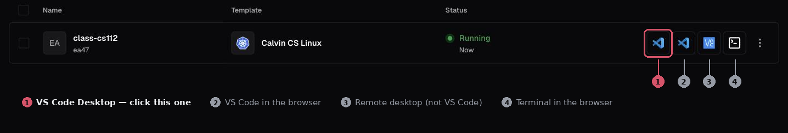
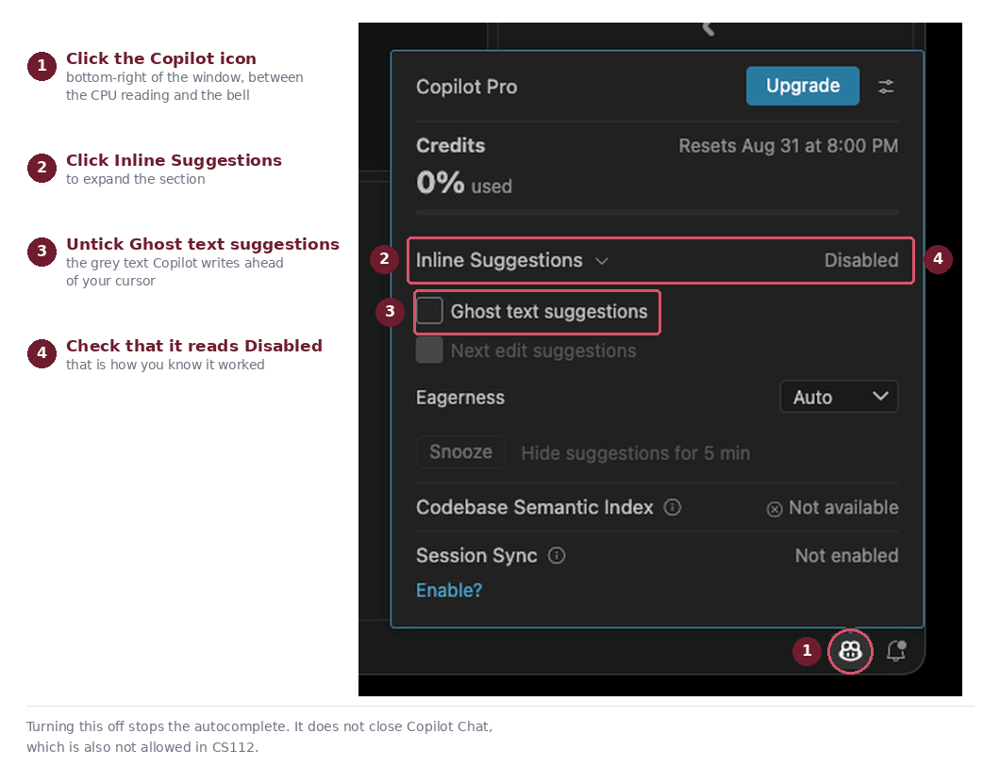

::: {.callout-note}
**Finish this before your first lab, on Tuesday, September 1.**

It does not count toward your grade. It exists so that you walk into that lab with your tools already set up and working, instead of spending the session installing things. If you get stuck, post on Moodle or email me at [eric.araujo@calvin.edu](mailto:eric.araujo@calvin.edu). I would far rather hear from you now than have you arrive on the first day stuck.

It is still submitted and checked like every other CS112 assignment, so you will see a score once you push. That score is practice, not part of your final grade.

**Plan to set aside about 1.5 to 2 hours.** Most of that time goes to the one-time setup steps: Coder, VS Code, and GitHub. Once those are done, they're done for the whole semester. The actual coding at the end is short.
:::

## Objectives

By the end of this assignment, you will be able to:

- Log in to Coder and work in a Linux terminal.
- Connect VS Code on your laptop to Calvin's Linux environment.
- Set up your GitHub account and accept a CS112 assignment.
- Clone your repository and open it in VS Code.
- Compile and run a C++ program with `make`, and explain what compiling does.
- Write basic C++ statements: variables, keyboard input, screen output, and a function call.
- Push your completed work to GitHub.

## 1. Introduction

**Welcome to CS112!**

You arrive in this course from different places. Some of you took CS108 and wrote Python. Some of you took AP Computer Science and wrote Java. Some of you have written a bit of everything. C++ will be new to all of you, and that is fine, because we start from the beginning.

The one thing C++ asks of you that a Python course did not is **compiling**. Before a C++ program can run, it must be translated from the source code you write into machine instructions the CPU executes directly. That extra step is what buys you the thing this whole course is about: direct control over memory, and the speed that comes with it. If you have written Java, this idea is already familiar.

In this course, we will write C++ using **Visual Studio Code** (VS Code) as our editor, but we will run and compile our programs on **Calvin's Linux servers** through a service called **Coder**. This means your editor lives on your laptop, but the C++ compiler lives on the server.

Four things about C++ are worth knowing before you write a line of it:

| | C++ |
|---|---|
| How you run it | compile first, then `./a00` |
| Variable types | you declare them yourself |
| End of a statement | a semicolon `;` |
| Grouping code | curly braces `{ }` |

If you are coming from Java, all four will look familiar. If you are coming from Python, the first three are the adjustment, and this assignment walks you through each one.

`a00` in that first row is this assignment's short name. It is also what your repository and your compiled program are called, so you will see it a lot from Step 9 onward.

By the end of this assignment you will have finished a small program called **the CS112 Oracle**. It asks your name, how nervous you are about the course, and the month you were born, and then prints your fortune. The function that chooses the fortune is already written for you. Your job is the part that talks to the person at the keyboard.

## 2. Create Your GitHub Account and Send Me Your Username

::: {.callout-important}
**Do this first, before anything else on this page.**

Everything else in CS112 depends on it, and it is the one step that needs *me*
to act. I add each student to the course organization by hand, and I may not get
to it for a day. Submit it now, then carry on with the rest of this assignment
while you wait. Nothing between here and Step 9 needs your GitHub account to be
ready.
:::

GitHub is where all your CS112 code will live. Every assignment is handed to you
as a private repository, you push your work there, and it is checked
automatically. It also means you can reach your work from any machine.

**If you do not already have an account:**

1. Go to [https://github.com](https://github.com){target="_blank" rel="noopener"} and sign up. Use your **Calvin email address**.
2. Complete the verification steps (you may need to set up two-factor authentication).
3. Skip any personalization steps by clicking "Skip Personalization" at the bottom.

**Then send me your username.** CS112 distributes and grades assignments through
**Classroom 50**, and there is no self-service sign-up: the class roster is built
by hand from the usernames students send in.

[Submit your GitHub username](https://forms.gle/Szw1io5HbxJC3nco7){.btn .btn-primary target="_blank" rel="noopener"}

The form asks for your Calvin email address, your name, your lab section, and
your GitHub username. Send the username itself, the one that appears in
`https://github.com/<username>`, not your email address and not your display
name. Open `https://github.com/<your-username>` in a browser first and check
that your own profile loads, because a username that does not exist cannot be
invited.

::: {.callout-warning}
**Once you have submitted, do not change or delete your GitHub username.** Your
repositories, your submissions, and your grades are all tied to it for the whole
semester. Renaming your account mid-course breaks the link between you and your
work, and untangling it is manual for both of us.
:::

Once I have added you, GitHub emails you an invitation to join the
**26fa-cs112** organization. **Accept that invitation** when it arrives. You will
need it in Step 9.

Now keep going. The rest of this page sets up the tools you will use, and none of
it has to wait on me.

## 3. Using Linux

All your CS112 work will run on a **Linux** server, and you will drive it from a **terminal**: a window where you type commands instead of clicking.

If that sounds like a step backwards, consider where Linux actually runs. Almost every web server on the internet. The machines that build and test code at every company you might intern for. Research clusters, supercomputers, the Mars helicopter, and the phone in your pocket if it is an Android. Most of those machines have no screen and no mouse attached, so typing commands is not the old-fashioned way to use them, it is the only way.

The practical version, for you, this semester: your compiler lives on that server. Every time you build a program, run it, or submit it, you will type a command. By December it will be muscle memory, and you will have a skill that transfers to every machine you touch for the rest of your career.

Here is what one looks like, and what the pieces of it mean:

{#fig-terminal fig-alt="A terminal window titled coder.cs.calvin.edu. Each line starts with a prompt reading jcalvin@cs112, a colon, the current folder, and a dollar sign. The session runs pwd, which prints /home/jcalvin, then mkdir cs112, then cd cs112, after which the folder in the prompt changes to ~/cs112 and pwd prints /home/jcalvin/cs112. Labels identify the username, the folder you are in, the place where you type, and the output a command prints back."}

The line you type on is called the **prompt**. It is telling you two useful things before you type anything: who you are, and which folder you are currently sitting in. When you move to a different folder, the prompt changes with you.

You do not need to memorize anything yet. **Step 6 walks you through each of these commands as you type it**, once you have a terminal open.

::: {.callout-tip}
If you want to go deeper on your own time, [Ubuntu's command-line tutorial](https://ubuntu.com/tutorials/command-line-for-beginners#1-overview){target="_blank" rel="noopener"} is a good free resource.
:::

## 4. Coder

The Calvin CS Department provides a service called [Coder](https://coder.cs.calvin.edu){target="_blank" rel="noopener"} that gives you access to a Linux environment and a C++ compiler. You do not need to install a compiler on your own laptop. Coder handles that.

Do this:

1. Open [https://coder.cs.calvin.edu](https://coder.cs.calvin.edu){target="_blank" rel="noopener"} in your browser.
2. Sign in using your **full Calvin email address** (e.g., `jcalvin@calvin.edu`).
3. Click **New Workspace** → **Calvin CS Linux**. That is the only template we use this semester.
4. Name it `class-cs112`. Leave all other options at their defaults. Click **Create Workspace**.
5. Wait a few seconds for your workspace to start. Leave this browser tab open, because Step 5 sends you back to it.

::: {.callout-warning}
**If any part of this does not work, email me immediately:**
[eric.araujo@calvin.edu](mailto:eric.araujo@calvin.edu).

I mean it. Do not spend an hour fighting it, and do not decide to deal with it
later. Coder is the one step where being stuck means you cannot do anything else
on this page, and when it fails it is almost always something on the
department's end rather than something you did. Tell me what you see, and
include a screenshot if you can.
:::

::: {.callout-note}
**Your workspace stops when you are not using it, and that is normal.**

Coder shuts an idle workspace down to free up resources for everyone else, so
when you come back the next day it may say **Stopped**. Press **Start**, wait a
few seconds, and you are back exactly where you left off.

**Your files are safe.** Your home folder on the server survives stops,
restarts, and the entire semester. Stopping a workspace is like closing a laptop
lid, not like erasing a disk. Nothing you have written disappears because the
workspace went to sleep.

Once you reach Step 13 you get a second layer of safety: anything you have
pushed to GitHub also exists there, independently of Coder.
:::

## 5. Installing and Connecting VS Code

We will edit code on your laptop using VS Code, but compile and run it on the Linux server through Coder.

**First, install VS Code on your laptop**

1. Go to [https://code.visualstudio.com](https://code.visualstudio.com){target="_blank" rel="noopener"} and download VS Code for your operating system. Install it.
2. Open VS Code.

**Then connect VS Code to Coder**

3. Return to the Coder browser tab. Your workspace row has four small buttons on the right. Click the **first** one, **VS Code Desktop**.

{#fig-vscode-button fig-alt="The Coder workspaces list showing one workspace running the Calvin CS Linux template. Four small buttons sit at the right-hand end of the row. The first is outlined and labelled VS Code Desktop, click this one. The second is VS Code in the browser, the third is a remote desktop and not VS Code, and the fourth is a terminal in the browser."}

::: {.callout-caution}
**Do not click "Open Desktop"** (the third button). It opens a remote desktop,
not VS Code, and it is the one students click by mistake. The button you want is
the leftmost, and hovering over it shows **Open VSCode**.
:::

4. When VS Code asks if you want to install the **Coder** extension, accept. This allows VS Code on your laptop to reach the compiler on the server.
5. **If** VS Code asks you to select the platform for the remote host, choose **Linux**. It may not ask, in which case skip this.
6. If asked to trust the authors, select **Yes, I trust the authors**. (You are the author.)
7. Open a terminal inside VS Code: **Terminal menu → New Terminal**. A terminal appears at the bottom of the window.

Do not open a folder yet. You will make one in the next step and open it then.

::: {.callout-tip}
**Shortcut:** In VS Code, press **Ctrl+`** to open (or toggle) the integrated terminal. On some keyboard layouts, if the backtick key is awkward to find, use **Terminal menu → New Terminal** instead.
:::

::: {.callout-note}
**That terminal is the same machine you saw in the Coder browser tab.** Not a
copy, not your laptop: the very same Linux server, reached a different way. A
file you create in one appears in the other. From here on, use the terminal
inside VS Code, because your editor and your commands are then in one window.
:::

## 6. Your First Commands, and Where to Store Your Work

You will have many assignments in CS112, so let us make one folder to keep them all in. You will learn the commands by using them.

::: {.callout-note}
**Two different things, and it is worth keeping them straight.**

`class-cs112` is your **workspace**: the Linux computer itself, the one you
start and stop from the Coder dashboard.

`cs112` is a **folder** on that computer, which you are about to create. It is
where your coursework will live.

The workspace is the machine. The folder is a drawer inside it.
:::

Use the terminal you just opened inside VS Code. Click in it, and it is waiting for you to type.

**Where am I?** Type this and press Enter:

```bash
pwd
```

`pwd` stands for **p**rint **w**orking **d**irectory. It answers the only question that matters when you are lost: where am I right now? You should see `/home/` followed by your username, for example `/home/jcalvin`.

::: {.callout-tip}
**That is your username on the server**, and it is worth noting down, because
this page asks for it twice more. It is also the first thing in your prompt, the
part before the `@`. If your prompt reads `jcalvin@class-cs112:~$`, your username
is `jcalvin` and your home folder is `/home/jcalvin`.
:::

**What is here?**

```bash
ls
```

`ls` **l**i**s**ts the files and folders in the current directory. Your account
starts with a handful of folders already in it:

```
Desktop  Documents  Downloads  Music  Pictures  Public  public_html  Templates  Videos
```

Those come with the account and you can ignore all of them. You are about to add
one of your own.

**Make a folder for the course:**

```bash
mkdir cs112
```

`mkdir` **m**a**k**es a **dir**ectory. Run `ls` again and you will see `cs112`
appear alongside the folders that were already there.

If it answers `mkdir: cannot create directory 'cs112': File exists`, you already
have one, which is fine. Carry on to the next command.

**Go into it:**

```bash
cd cs112
```

`cd` **c**hanges **d**irectory. Confirm it worked:

```bash
pwd
```

You should now see `/home/<username>/cs112`, where `<username>` is your Calvin username. Every assignment you clone this semester will live inside this folder.

To go back up one level, use two dots:

```bash
cd ..
```

Run `cd cs112` again before moving on, so you finish this step inside the course folder.

### Two habits that will save you hours

::: {.callout-important}
**Press Tab instead of typing.** Type the first few letters of a file or folder name and press the **Tab** key. Linux completes the rest for you. If nothing happens, either the name does not exist or more than one thing starts with those letters, in which case pressing Tab twice lists the candidates.

This matters more than it sounds. In Step 9 you will change into a folder called something like `cs112-a00-jcalvin1837`. Typing `cd cs112` then pressing Tab is faster than typing it out, and it cannot produce a typo. Most "no such file or directory" errors in this course are typos in a name that Tab would have completed correctly.

**Press the Up arrow to repeat a command.** Your last commands are remembered. Up arrow walks back through them, and Enter runs the one you land on. You will run `make` and `./a00` over and over while debugging, and Up-Up-Enter beats retyping every time.
:::

### The rest of the commands you will need

You have now used five commands. Here is the full set for the semester, so you have one place to look them up:

| Command | What it does |
|---|---|
| `pwd` | **P**rint **w**orking **d**irectory: where am I? |
| `ls` | **L**i**s**t the files and folders here |
| `ls -a` | List **a**ll of them, including hidden files (see below) |
| `cd folder` | **C**hange **d**irectory: go into `folder` |
| `cd ..` | Go up one level |
| `cd` | With nothing after it, go straight back to your home folder |
| `mkdir folder` | **M**a**k**e a new **dir**ectory |
| `cat file` | Print the contents of a file to the screen |
| `echo text` | Print `text` back to the screen |
| `command > file` | Send output into `file` instead of to the screen |
| `rm file` | **R**e**m**ove a file. See the warning below |

`cd` on its own is the one worth remembering from that list: however lost you
get, typing `cd` and pressing Enter puts you back at `/home/<username>`, and you
can start again from there.

Three more you will meet later in this assignment, explained where they appear: `git` (Step 9), `make` (Step 11), and `./a00` to run your compiled program (Step 11).

::: {.callout-warning}
**`rm` does not use a trash can.** There is no undo and no Recycle Bin on a Linux server. A file you `rm` is gone. Read the line twice before you press Enter, and never run `rm` with a `*` in it unless you are certain what it matches.
:::

**Try `cat` and `rm` once, on a file that does not matter.** Make one:

```bash
echo "hello from CS112" > scratch.txt
```

On its own, `echo` would print that sentence straight back at you. The `>`
redirects it into a file instead, which is why nothing appears on screen. Read it
back:

```bash
cat scratch.txt
```

`cat` prints a file's contents to the screen. It is how you glance at a short
file without opening an editor. Run `ls` and you will see `scratch.txt` sitting
in your folder. Now delete it:

```bash
rm scratch.txt
```

Run `ls` once more. It is gone, and there is nowhere to go looking for it. That
is the whole lesson: `rm` is immediate and final. Better to learn it on a file
called `scratch.txt` than on your assignment.

### Hidden files

A file whose name begins with a dot is **hidden**: `ls` will not show it. This is a convention, not a security feature, and it exists to keep configuration files out of your way.

Your assignment repository will contain several of them, including `.gitignore` (which tells Git which files to leave alone) and a `.git` folder (where Git keeps your entire history). To see them:

```bash
ls -a
```

Worth knowing now, because sooner or later you will be certain a file exists, `ls` will disagree with you, and `ls -a` will settle the argument.

### Finish by opening your folder in VS Code

You have a course folder now. Point the editor at it, so that your files and your
terminal are in the same place for the rest of the semester.

Choose **File → Open Folder**, type `/home/<username>/cs112` (with your own
username, the one you noted down earlier), and click OK. VS Code reconnects with
the course folder open. If it asks whether you trust the authors, say yes.

Open a terminal again with **Terminal → New Terminal**, and run:

```bash
pwd
```

It should print `/home/<username>/cs112`. When it does, your editor and your
terminal are both pointed at the same folder, your environment is finished, and
everything from here on happens inside it.

## 7. Set Up VS Code for C++

A few one-time settings will make your life much easier all semester.

**Install the C++ extension:**

This is what gives you C++ syntax colouring, code formatting, and the squiggly underlines that flag mistakes as you type. Open the **Extensions** panel (left sidebar), search for `C/C++ Extension Pack`, and click **Install**.

You have no C++ files yet, so install it directly rather than waiting for VS Code to offer it when you open one.

**Configure Auto Save:**

Open the Settings editor with **Ctrl+,** (**Cmd+,** on a Mac). In the search bar at the top, type `files.autoSave`, and set it to **onFocusChange**.

This saves the file whenever the focus leaves the editor, so you will not lose work by forgetting to save. Leave the Settings tab open, because the next two settings are in it too.

**Set Tab Size:**

In the same Settings tab, search for `editor.tabSize` and set it to **4**.

**Set C++ Formatting Style:**

A **formatter** tidies your code for you: consistent indentation, consistent
spacing, line breaks in sensible places. You write it however it comes out, then
press a key and it straightens up. Setting the same style now means your code and
mine and your classmates' all look alike, which makes code far easier to read
together, and it means you never argue with yourself about indentation again.

Under **Extensions → C/C++ → Formatting**, find `C_Cpp: Clang_format_style`.
Use the copy button in the corner of the box below, then paste it into the
setting. It has to go in as **one line**, so copy it rather than retyping it:

```default
{ BasedOnStyle: Google, IndentWidth: 4, AccessModifierOffset: -4, AllowShortFunctionsOnASingleLine: InlineOnly }
```

It is long, and the settings box will only show you the start of it. That is
normal, and you never have to read it there. Here is what each piece of it does:

| Piece | What it does |
|---|---|
| `BasedOnStyle: Google` | start from Google's published C++ style |
| `IndentWidth: 4` | indent by four spaces |
| `AccessModifierOffset: -4` | pull labels like `public:` back toward the left margin |
| `AllowShortFunctionsOnASingleLine: InlineOnly` | only keep a function on one line if it is very short |

Nothing will look different yet, because you have no C++ code. Once you do, the
**Format Document** command reformats the file you are looking at, and that is how
you will know this setting took. The shortcut depends on your laptop:

| Your laptop | Format Document |
|---|---|
| Windows | **Shift+Alt+F** |
| macOS | **Shift+Option+F** |
| Linux | **Ctrl+Shift+I** |

If you would rather not remember it, right-click in the file and choose **Format
Document**.

## 8. No AI Assistants in CS112

::: {.callout-important}
**This is a course rule, not a suggestion.** No AI coding assistant may write,
complete, or explain code for you in CS112. If you are found using one during
lab, you do not receive the completion check for that assignment.
:::

**Why this rule exists.** Three times this semester you will sit in my office for
twenty-five minutes, and I will hand you a question drawn from each cluster of
skills that window covers. Sometimes a prompt to talk through, sometimes a short
piece of code to write there and then. No assistant, no browser tab, no notes.
Just you and the question.

Those three sessions are the backbone of your grade. Nothing you submitted gets
you through them; the only thing that helps is being able to do the work. The
assignments are the practice that builds that ability, and an assistant that
does your assignments for you does not make the check-in easier. It makes the
check-in the first time you have ever tried.

The other reason is simpler. You are here to learn to build these structures
yourself, from memory up, and that skill is built by struggling with a compiler
error for twenty minutes and then understanding it. An assistant hands you the
answer and takes the twenty minutes away, along with everything you would have
learned in them.

**This applies to every assistant, not only Copilot.** Copilot and Copilot Chat,
Cursor, Windsurf, ChatGPT, Claude, Gemini, and anything else that writes or
finishes code for you. Closing one extension while another sits in a browser tab
is not following the rule. See the [academic honesty
policy](../../policies/honesty.qmd) for how this fits with the rest of the
course.

**To turn every AI feature off in VS Code:**

VS Code has one setting that does the whole job. It hides chat, turns off inline
suggestions, and disables the Copilot extensions outright.

1. Open the Settings editor: **Ctrl+,** (**Cmd+,** on a Mac).
2. In the search box at the top, type `chat.disableAIFeatures`.
3. Above the results are tabs reading **User**, **Remote [Coder: …]**, and
   **Workspace**. Click **Remote**.
4. Tick the checkbox.

Choosing **Remote** applies the setting to the Calvin server, which is where all
your CS112 work happens. Anything you write on your own laptop, for your own
projects, is untouched.

After that, the Copilot icon disappears from the status bar and the chat panel
goes away. That is what you want to see.

### If you would rather only silence the autocomplete

Some of you use Copilot in other courses and would rather not disable it wholesale
on the server. There is a lighter switch that stops the suggestions without
turning the extension off. It is **not** enough on its own for CS112, because it
leaves the chat panel working, but it is the fastest way to stop code appearing
under your cursor while you think.

{#fig-copilot fig-alt="The bottom-right corner of the VS Code status bar with the Copilot icon circled, and the panel that opens when you click it. The Inline Suggestions row and the unticked Ghost text suggestions checkbox are outlined, and the word Disabled appears at the right of the Inline Suggestions row."}

If you take this route, you are on your honour about the chat panel. The rule is
the same either way.

::: {.callout-important}
**This covers every assistant that plugs into VS Code**, not only Copilot. If you
also use ChatGPT, Claude, Gemini or anything similar in a browser while you work,
the rule still applies. Closing one panel and opening another tab is not
following it.
:::

## 9. Accept the Assignment and Clone Your Repo

Each assignment in CS112 is distributed through **Classroom 50**. When you accept an assignment, a private repository is created just for you with the starter code already inside. Only you and the instructor can see it.

::: {.callout-important}
**First, make sure both parts of Step 2 are done:** you have sent your GitHub username to your instructor, and you have accepted the emailed invitation to the **26fa-cs112** organization. If either is missing, the accept link will not work. Go back and finish Step 2, and email me if you have been waiting more than a day.

Then get the **Getting Started accept link from Moodle** and open it there. All CS112 accept links are distributed through Moodle so that only Calvin students can accept assignments.

After you accept, wait a few seconds and then click through to your new repository.
:::

::: {.callout-note}
Your repository will be named `cs112-a00-YOURUSERNAME`. Every assignment this semester follows the same pattern: `cs112-<assignment>-<your username>`.
:::

**Get the repo URL:**

On your repository page, click the green **\<\> Code** button, then the **SSH** tab. Click the copy icon to copy the URL (it starts with `git@github.com:...`).

**Clone the repo:**

In your VS Code terminal (the one connected to Coder), make sure you are in your `cs112` folder:

```bash
pwd
```

If you are not, run `cd ~/cs112`. Then clone:

```bash
git clone <paste-your-repo-url-here>
```

If this is your first time using Git with Coder, you will see an error about SSH keys. Read the next section.

### Setting Up SSH Keys for GitHub

GitHub requires an SSH key to verify your identity. Coder generates one for you automatically. When `git clone` fails, look at the error output. Somewhere near the top you will see a public key that looks like:

```
ssh-ed25519 AAAAC3NzaC1lZDI1NTE5AAAA...
```

Copy that entire line. Then:

1. Go to [https://github.com/settings/keys](https://github.com/settings/keys){target="_blank" rel="noopener"}.
2. Click **New SSH Key**.
3. Title: `CS112 Coder`
4. Paste the key into the Key field. Click **Add SSH Key**.

Now retry the clone:

```bash
git clone <paste-your-repo-url-here>
```

This time it should succeed. Verify by listing your files:

```bash
ls
```

You should see a directory named `cs112-a00-YOURUSERNAME`. Change into it:

```bash
cd cs112-a00-YOURUSERNAME
ls
```

You will find six files: `main.cpp`, `fortune.h`, `fortune.cpp`, `makefile`, `test.py`, and `README.md`.

Open this folder in VS Code: **File → Open Folder**, then navigate to `/home/<username>/cs112/cs112-a00-YOURUSERNAME`.

### One last setting, now that you have C++ code

There is one VS Code setting that could not be done in Step 7, because the
command does not show up until the C/C++ extension has something to work on. You
have a C++ file now.

1. In the VS Code file list, click **`main.cpp`** to open it. This wakes up the
   C/C++ extension, which is why the command below did not appear in Step 7.
2. Press **Ctrl+Shift+P** (**Cmd+Shift+P** on a Mac).
3. Search for `C/C++: Select IntelliSense Configuration`.
4. A list of the compilers found on the machine appears. Choose the **g++** entry.
   On this server the compiler lives at `/usr/bin/g++`, so that is the path you
   should see next to it.

This tells the editor which compiler you are actually building with, so the
underlines it draws match the errors `make` will report. Without it, VS Code
guesses, and it can flag things that compile perfectly well or stay silent about
things that do not.

While `main.cpp` is open, try **Shift+Alt+F** (**Shift+Option+F** on a Mac). The
file reformats itself using the style you set in Step 7. Nothing about the code
changes, only its shape.

## 10. Understanding the Makefile

Before you compile anything, let us understand *how* compilation works. This is the step that has no equivalent in an interpreted language, and it is worth ten minutes of your attention now.

### How C++ compilation works

Your source code goes through **two stages** before it can run:

**Stage 1: Compile.** Each `.cpp` source file is individually translated into an **object file** (`.o`). Object files contain machine code, but they are not yet runnable, because they might refer to functions defined in other files.

**Stage 2: Link.** The **linker** combines all the `.o` files into a single **executable** (in our case, a file called `a00`). This is the program you actually run.

```{mermaid}
flowchart LR
	A[main.cpp] -->|compile| B[main.o]
	C[fortune.cpp] -->|compile| D[fortune.o]
	B -->|link| E[a00]
	D -->|link| E
	E -->|run| F[output]
```

Doing this manually every time would look like:

```bash
g++ -Wall -std=c++17 -c main.cpp        # produces main.o
g++ -Wall -std=c++17 -c fortune.cpp     # produces fortune.o
g++ -Wall -std=c++17 -o a00 main.o fortune.o  # produces a00
```

That is three commands, and if you only changed `fortune.cpp`, you would still have to remember which commands to re-run. A **makefile** automates this.

### Reading the makefile

Open `makefile` in VS Code. Here is what each part does:

```makefile
CXX      = g++
CXXFLAGS = -Wall -std=c++17
```

These are **variables**. `CXX` is the compiler name. `CXXFLAGS` are the options we always pass to it: `-Wall` turns on all warnings (helpful!), `-std=c++17` selects the C++17 standard.

```makefile
a00: main.o fortune.o
	$(CXX) $(CXXFLAGS) -o a00 main.o fortune.o
```

This is a **rule**. The format is:

```
target: dependencies
    command
```

`a00` is what we want to build. It depends on `main.o` and `fortune.o`. If either of those is out of date, `make` runs the command to rebuild `a00`. Notice the command line starts with a **tab character**. Makefiles require this, not spaces.

```makefile
main.o: main.cpp fortune.h
	$(CXX) $(CXXFLAGS) -c main.cpp
```

This rule says: to build `main.o`, compile `main.cpp` (the `-c` flag means "compile only, don't link yet"). It depends on `fortune.h` too: if the header changes, `main.o` needs to be rebuilt.

```makefile
fortune.o: fortune.cpp fortune.h
	$(CXX) $(CXXFLAGS) -c fortune.cpp
```

Same idea for `fortune.cpp`.

```makefile
clean:
	rm -f *.o a00
```

`make clean` deletes all object files and the executable. Use this when you want a completely fresh build.

### `make` is smart about what to rebuild

One of `make`'s best features: it only recompiles files that have changed since the last build. If you only edit `fortune.cpp`, `make` will recompile `fortune.o` and re-link `a00`, but it will *not* recompile `main.cpp`, because `main.cpp` has not changed. This saves time on larger projects.

## 11. Compile and Run the Starter Code

In your VS Code terminal, make sure you are inside your `a00-yourgithubusername` directory. Then type:

```bash
make
```

You should see output like:

```
g++ -Wall -std=c++17 -c main.cpp
g++ -Wall -std=c++17 -c fortune.cpp
g++ -Wall -std=c++17 -o a00 main.o fortune.o
```

Type `ls`. You should now see `a00` in the directory. Run it:

```bash
./a00
```

The `./` means "run this file in the current directory."

You will see the Oracle's banner and the line about consulting the ancient data structures, and then the program ends without ever asking you anything. That is expected: `main.cpp` still has empty placeholders where the questions and the fortune belong. Filling them in is your task in the next section.

## 12. Your Coding Task: Complete `main.cpp`

Open `main.cpp` in VS Code. This is the only file you will edit. `fortune.cpp` and `fortune.h` are already complete. Read through them to get a sense of how a C++ function is written, but do not change them.

`main.cpp` has four TODO comments. Work through them in order.

---

### TODO 1: Declare your variables

Every variable in C++ is declared with a **type**, before you use it. The type tells the compiler how much memory the variable needs and what may be stored in it:

```cpp
string name;
int stressLevel;
int birthMonth;
```

`string` holds text. `int` holds a whole number. Notice the semicolon at the end of each line. Every statement in C++ ends with one.

Add these three declarations where TODO 1 is.

---

### TODO 2: Print prompts and read input

Use `cout` to print a line to the screen and `cin` to read input from the keyboard.

**Printing with `cout`:**

```cpp
cout << "What is your name? ";
```

The `<<` operator sends text to the output stream. Note there is **no** `endl` here, because we want the cursor to stay on the same line so the user types right after the prompt.

**Reading with `cin`:**

```cpp
cin >> name;
```

The `>>` operator reads one word (or number) from the keyboard and stores it in the variable.

Notice that printing the prompt and reading the answer are **two separate statements** in C++. Write one `cout` and one `cin` for each of the three pieces of information.

Use these exact prompt strings (the autograder will check them):

```
"What is your first name? "
"On a scale of 1-5, how nervous are you about CS112? "
"What month were you born in (1-12)? "
```

::: {.callout-warning}
**Why "first name" and not "name"?**

`cin >>` stops reading at the first space. If the prompt said "What is your name?" and someone typed `Eric Araujo`, `cin` would put `Eric` in `name` and leave `Araujo` sitting in the input, and the very next `cin >> stressLevel` would try to read `Araujo` as a number, fail, and leave both numbers as garbage. The program would still run, print a wrong fortune, and never tell you anything was wrong.

Many languages hand you the whole line when you ask for input. `cin >>` hands you one word at a time. Asking for a first name sidesteps the problem for now, and you will learn how to read a whole line later in the semester.
:::

---

### TODO 3: Call `getFortune()`

`getFortune()` is a function declared in `fortune.h`. It takes two `int` parameters and returns a `string`. Call it like this:

```cpp
string fortune = getFortune(stressLevel, birthMonth);
```

This creates a new `string` variable named `fortune` and stores the result of the function call in it. Add this line where TODO 3 is.

---

### TODO 4: Print the Oracle's response

Use `cout` to print two lines inside the banner:

```
  The Oracle speaks, NAME!
```
*(an empty line)*
```
FORTUNE
```

Where `NAME` and `FORTUNE` are your variables. In C++, you can chain multiple things on one `cout` line:

```cpp
cout << "  The Oracle speaks, " << name << "!" << endl;
```

---

### Compile and test

After filling in all four TODOs, compile:

```bash
make
```

If you see errors, read them carefully. The compiler tells you the file name and line number of the problem. Fix the error and `make` again.

Run the program:

```bash
./a00
```

Enter your name, a stress level between 1 and 5, and your birth month. You should see the full Oracle experience, including a fortune at the end.

Once it looks right, run the autograder:

```bash
make test
```

You will see a PASS or FAIL for each test case, with hints if something is wrong. Fix any failures and run `make test` again until all tests pass.

There are 14 checks, one per requirement, so a failure points at exactly one thing. An untouched starter scores `0 / 14`. When all four TODOs are done you should see:

```
Results: 14/14 passed
All tests passed. Push your code to GitHub.
```

::: {.callout-note}
**There are no hidden tests.** What you run with `make test` is exactly what the grader runs: all 14 checks. If it passes here, it passes there.

Grading always runs the official test suite, not the copy in your repository. Editing `test.py` will not change your score.
:::

::: {.callout-note}
**What about `make clean`?**

If edits do not seem to take effect, try:

```bash
make clean
make
```

This forces a completely fresh build.
:::

## 13. Push Your Code to GitHub

When all tests pass, submit your work to GitHub.

::: {.callout-important}
Add your name to the `README.md` file before pushing. Open it in VS Code, add a line with your name, and save.
:::

In VS Code, look at the **Source Control** icon in the left sidebar (it looks like a branch). Click it. You will see your changed files listed. Type a short commit message (e.g., `"Complete main.cpp"`), then click the **checkmark** to commit. Follow any prompts to sync/push to your remote repository.

To verify the push worked, go to your repository page on github.com and confirm you can see your updated `main.cpp`.

Within a minute or two, the **Actions** tab of your repository shows the grading run, and a **Release** appears with your score and a per-check breakdown. Getting Started does not count toward your course grade. It is here so that this machinery is already familiar when it does.

## You are ready!

Congratulations! Your development environment is set up and you have written your first C++ code for CS112. See you in class!

::: {.callout-tip}
**Working from home?** As long as you have VS Code and can connect to Coder, you can do all your CS112 work from your laptop anywhere with internet. The setup you did today is all you need.
:::
